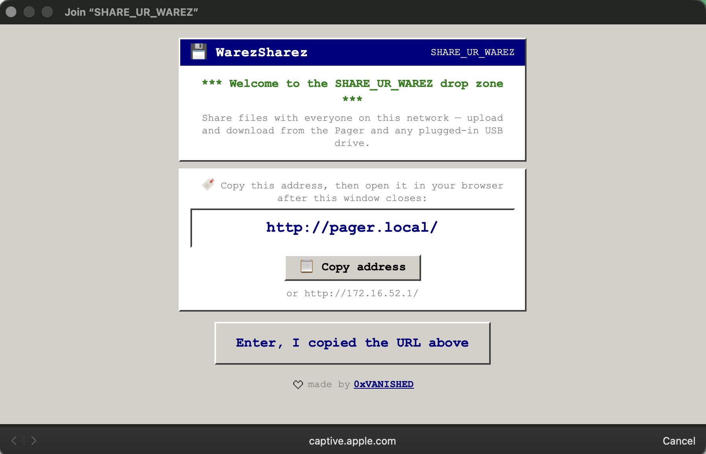
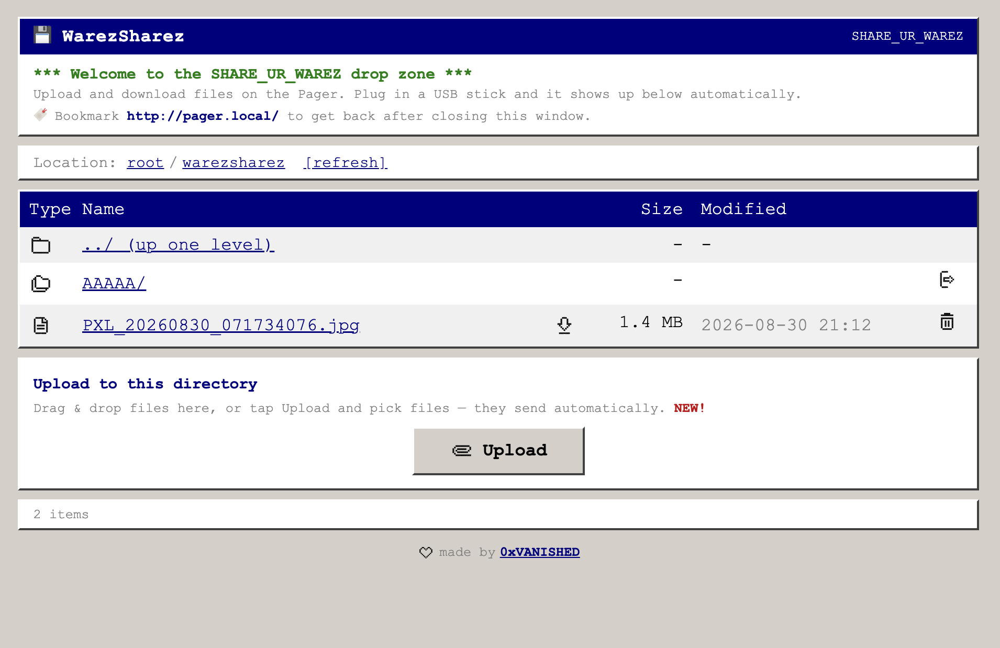

# WarezSharez

A pocket file-share for the [WiFi Pineapple Pager](https://hak5.org/products/wifi-pineapple-pager). Use this to solve the problem of "`oh I only have that file on a usb drive`", or if you just want to share stuff with friends on a whim.

Runs an open access point **`SHARE_UR_WAREZ`** with an auto-launching captive portal. Anyone who joins gets a simple web UI to upload and download files on the Pager. Plug a USB stick in and it shows up in the same list automatically.




---

## What it does

- Turns on the Pineapple's Open AP as **`SHARE_UR_WAREZ`**. It uses the same `uci` the PineAP UI writes and leans on PineAP for the radio and DHCP. It does not reconfigure bridges.
- Pops a captive portal welcome page on connect, with a big button to open the share in your browser.
- Auto-mounts any USB drive and drops it straight into the main file list once it's plugged in. Unplug it and it goes away. Uploads are flushed to disk so it's safe to pull, and there's an `eject` link if you want to be sure.

It works like Hak5's **GoodPortal**: nginx, a rogue DNS server, and firewall redirects layered onto the LAN the Open AP already serves (`br-lan`, `172.16.52.1`)

> **Use responsibly.** this is a plain LAN file share. Run it on networks and hardware you own or are authorized to operate. You are responsible for what gets shared over it. Everything is owned by root LOL, use at your own risk.

---

## Requirements

- WiFi Pineapple Pager
- The installer turns the Open AP on for you, no manual setup. Just make sure PineAP's client and network filters aren't blocking anyone (they're `deny` with empty lists by default, which lets everyone in).
- Internet on the Pager for the first install, to pull nginx, PHP, and the USB packages.

---

## Installing

Get the files onto the Pager, then run the payloads from the Pager menu. `scp` is the easy way like here:

### Copy to the Pager

```bash
scp -r payloads/ root@<PAGER_IP>:/mmc/root/
```

That lands as:

```
/mmc/root/payloads/user/WarezSharez/
├── warezsharez_install/
│   ├── payload.sh
│   ├── portal/     # the web app the installer deploys
│   └── hotplug/    # USB auto-mount hook
├── warezsharez_start/
├── warezsharez_stop/
├── warezsharez_status/
└── warezsharez_uninstall/
```

Each payload is its own folder so the Pager picks it up. `portal/` and `hotplug/` live inside `warezsharez_install` because that's the payload that copies them onto the device.

### Run the payloads

From the Pager's payload menu, in order:

1. **`WarezSharez - Install`**. Installs the packages, deploys the portal, sets up the captive portal, and turns on the `SHARE_UR_WAREZ` Open AP.
2. **`WarezSharez - Start`**. Brings the runtime back up after a reboot.
3. Join **`SHARE_UR_WAREZ`** from a phone or laptop. The welcome page opens on its own.

Manage it later with the `Start`, `Stop`, `Status`, and `Uninstall` payloads.

---

## Using it

Join `SHARE_UR_WAREZ` and the welcome page pops up. It shows the address to get back to the share, **`http://pager.local/`** (or your `hostname.local`) (with `http://172.16.52.1/` as a fallback).

- Tap **Open in Browser** to jump into the file list in your real browser. The captive popup can't open a file picker, so uploads need a real browser tab.
- Click a file name to open it inline. Use the download arrow next to the name to save the actual file.
- Uploading is one button. Tap Upload, pick your files, and they send automatically.
- USB drives show up in the main list as they mount. Tap `eject` before you pull one to flush writes.

**Where you can write:** uploads and deletes work inside the share (`/mmc/root/warezsharez`) and on any mounted USB drive. You can browse and download from the wider `/mmc/root` tree, but not write to it.

**Deleting** is on by default. To turn it off, set `WAREZ_ALLOW_DELETE=0` (a php-fpm pool `env`, or an nginx `fastcgi_param`) and reload. The `del` links disappear and the API refuses deletes.

---

## How it connects

The Pineapple owns the radios and DHCP. WarezSharez sets the Open AP's SSID and layers the portal on top. It never touches bridges or DHCP.

- PineAP broadcasts `SHARE_UR_WAREZ`, associates clients, and hands out `172.16.52.x` addresses.
- WarezSharez runs nginx on `172.16.52.1`, a rogue dnsmasq on `:1053`, and firewall redirects that bounce client DNS and HTTP to the portal so the sign-in page appears. IPv6 on `br-lan` is turned off while it's running, otherwise Android slips past the IPv4 hijack.

If clients can't connect, split the problem. Stop WarezSharez, join the Open AP, and check you get an address and can reach `http://172.16.52.1`. If that fails it's the Open AP or PineAP config. If that works but the portal doesn't, it's WarezSharez, so check `WarezSharez - Status`.

---

## Uninstalling

Run **`WarezSharez - Uninstall`**. It confirms first, then backs everything out:

- Deletes `/mmc/root/warezsharez` and the files in it. USB drives are unmounted first, so files on the drives are never wiped.
- Stops the DNS hijack, removes the firewall rules, restores the original `nginx.conf`, re-enables UCI nginx and IPv6, and removes the hotplug hook and `/www/warezsharez`.
- Restores the Open AP to its pre-install state, or disables it if there's no backup so it stops broadcasting `SHARE_UR_WAREZ`.
- Leaves nginx, PHP, umdns, and the USB packages installed.

---

## Rebuilding the web UI

So, I got a few different models to help me route the UI logic... PHP sucks, but it's not really a big problem. If you dont like the web UI please use something you think would be better but I'm not in the business of writing a super cool file browser. PRs against it to clean up or add better JS views are more than welcome!

The UI is constructed via a small [vite](https://vitejs.dev/) project, tailwind CSS v4 with jQuery bundled from npm (no CDN). Vite runs on your machine and spits out static files. The Pager only ever serves the built output.

```bash
cd src
npm install
npm run dev      # local stack: dummy files + fake USB, PHP API + Vite HMR
npm run build    # build to dist/
npm run deploy   # copy build files to the other directories
```
